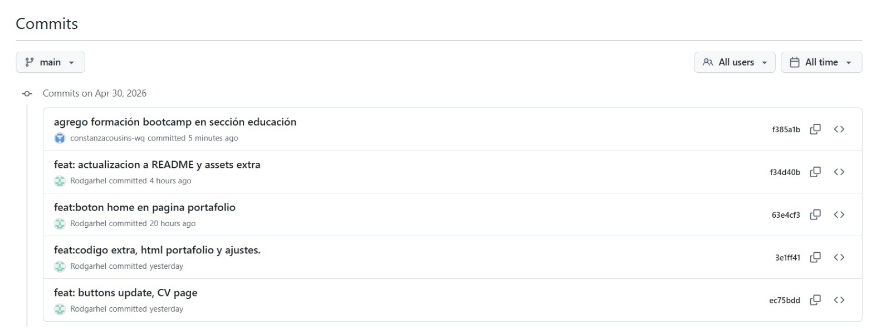

# 💻 Portafolio Web – Constanza Cousins

Este proyecto corresponde a la construcción de mi CV/portafolio web, desarrollado como parte del bootcamp Fullstack JavaScript.

La página presenta mi perfil como diseñadora gráfica, integrando experiencia en diseño textil, ilustración y proyectos culturales, junto con mis primeros desarrollos en frontend.

---

## Demo

Puedes ver el proyecto en línea aquí:

👉 https://constanzacousins-wq.github.io/

---

## Objetivo

Desarrollar una página web tipo CV que incluya:

- Presentación personal
- Sección de educación
- Experiencia profesional
- Portafolio de proyectos
- Formulario de contacto

---

## Tecnologías utilizadas

- HTML5
- CSS3
- Bootstrap 5
- Git & GitHub
- GitHub Pages

---

## Proyectos incluidos

Dentro del portafolio se integran los siguientes proyectos:

- **Landing Page**  
  Desarrollo de una página responsive utilizando Bootstrap.

- **Sistema de cupones (Cuppon)**  
  Uso de grillas, componentes y estilos de Bootstrap.

- **Estructura HTML**  
  Primer proyecto enfocado en estructura base, etiquetas y organización del contenido.

---

##  Cómo usar este proyecto

1. Clona este repositorio:
```bash
git clone https://github.com/constanzacousins-wq/constanzacousins-wq.github.io.git


## 📸 Evidencia Fork 1

## 📸 Evidencia Fork 1


## 📸 Evidencia Commit Fork 1
